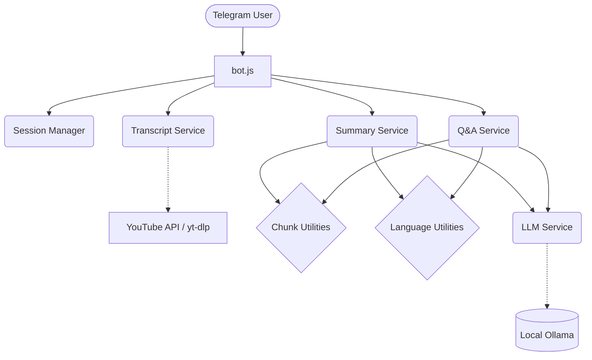

# Telegram YouTube Assistant Bot 🤖📺

A highly scalable, intelligent Telegram bot that fetches YouTube transcripts and uses a **local LLM** (Ollama) to summarize, deep dive, and answer questions grounded entirely in the video content. Supports multi-language querying without the need for external translation APIs!

## 🛠️ Technologies Used


---

## 🏗 Architecture & Flow



### How it works:
1. **User Interaction**: Users send YouTube links directly to the Telegram bot.
2. **Transcript Fetching**: The bot leverages `yt-dlp` or YouTube APIs to extract the subtitle/transcript data.
3. **Session Management**: User contexts are managed to provide seamless follow-up Q&A capability.
4. **Chunking Mechanism**: Transcripts are chunked if they exceed standard lengths, ensuring the Local LLM processes text correctly.
5. **Local LLM Processing**: The text data is parsed and sent to local LLM instances via Ollama (e.g., Llama 3, Mistral) for summarization and answering queries without incurring API costs.

---

## ✨ Features

- **✅ Fully Local LLM Integration**: Uses Ollama (Mistral/Llama 3) for zero API costs.
- **✅ Grounded Q&A**: Strictly hallucinates nothing; answers are based solely on the YouTube transcript.  
- **✅ Multi-Language Support**: Automatically detects language from user prompts (e.g., "Summarize in Hindi") and responds in the detected language.  
- **✅ Chunking for Long Videos**: Handles extremely long transcripts gracefully to avoid LLM context-window limits.
- **✅ Robust Architecture**: Modular service-oriented structure designed for production scalability.
- **✅ Session Management**: Multi-user support enabled out-of-the-box.

---

## 🤖 Bot Commands

Once a YouTube link is processed, you can interact with the bot using the following commands:
- `/summary` (or `/summaryenglish`, `/summaryhindi`) - Generates a concise summary of the video.
- `/deepdive` - Provides a comprehensive analysis of the core themes discussed in the video.
- `/actionpoints` - Extracts all actionable items, tasks, and key takeaways as a bulleted list.
- Or simply ask any question directly, like *"What did they say about Node.js?"*.

---

## 🛠️ Why Node.js?
Node.js was selected for this bot for several reasons, making it exceptional for SDE evaluation:
- **Superior Concurrency**: Handling multiple Telegram users simultaneously is effortless due to the non-blocking I/O model.
- **Scalability**: Can seamlessly scale horizontally if deployed on the cloud.
- **Cleaner Async Handling**: Excellent native support for Promises and `async/await`, crucial when dealing with varying delays from the Local LLM and network.

## 🧠 Why Ollama & Local LLM?
### Pros
- **Zero Cost**: No OpenAI or Anthropic API bills. Run inference entirely locally on the server hardware.
- **Privacy & Security**: All transcript content and user inquiries remain private.
- **Offline Capable**: Functions seamlessly without needing constant access to a third-party intelligence provider.

### Trade-offs
- **Hardware Dependent**: Inference speed is entirely bound by the server's CPU/GPU capabilities.
- **Context Window Limits**: Local models might struggle with enormous transcripts without proper chunking mechanisms.
- **Model Size vs Intelligence**: Smaller models (`8B` parameters) are faster but might miss nuanced subtleties compared to `GPT-4`.

---

## 🚀 Setup & Installation

### 1. Prerequisites
- **Node.js** (v18+) -> [Download](https://nodejs.org)
- **Ollama** -> [Download](https://ollama.com/)
- **yt-dlp** (Included or install manually if needed)

### 2. Pull the Local Model
```bash
ollama pull llama3
# or 
ollama pull mistral
```

### 3. Clone & Install
```bash
git clone https://github.com/your-username/telegram-youtube-bot.git
cd telegram-youtube-bot
npm install
```

### 4. Environment Keys
Create a `.env` file in the root directory and add your Telegram bot token.
```env
BOT_TOKEN=your_telegram_bot_token
YOUTUBE_API_KEY=your_youtube_token
OLLAMA_URL=http://localhost:11434
MODEL=mistral
```

### 5. Start the Bot
```bash
node src/bot.js
```

---

## 📸 Screenshots
*(Visual demos of interaction flow)*
- **Multi-language Query**: 
- **Deep Dive**: 

---
*Built with ❤️ utilizing Node.js & local AI capabilities.*
